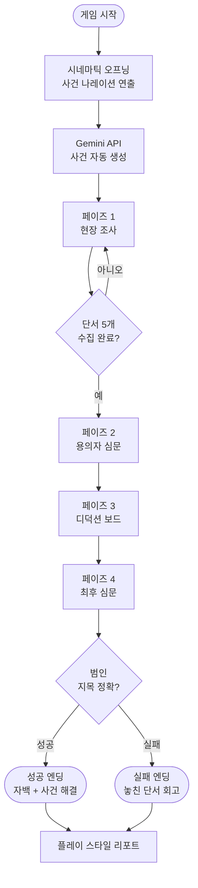
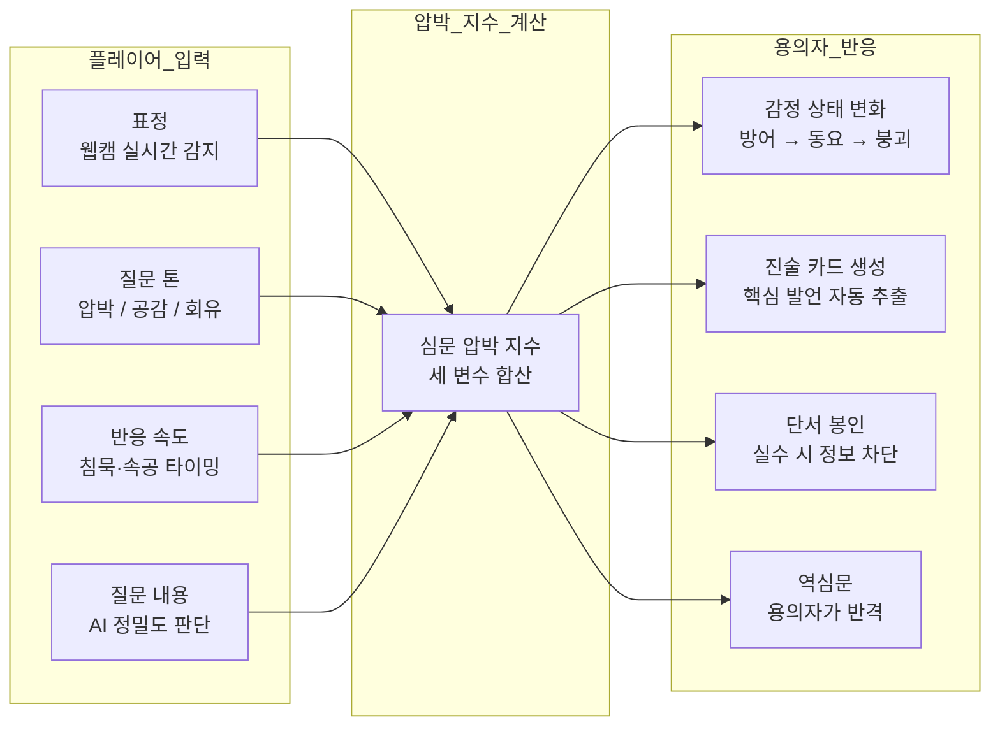
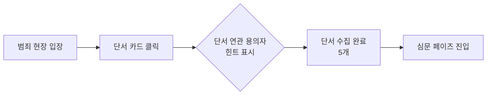
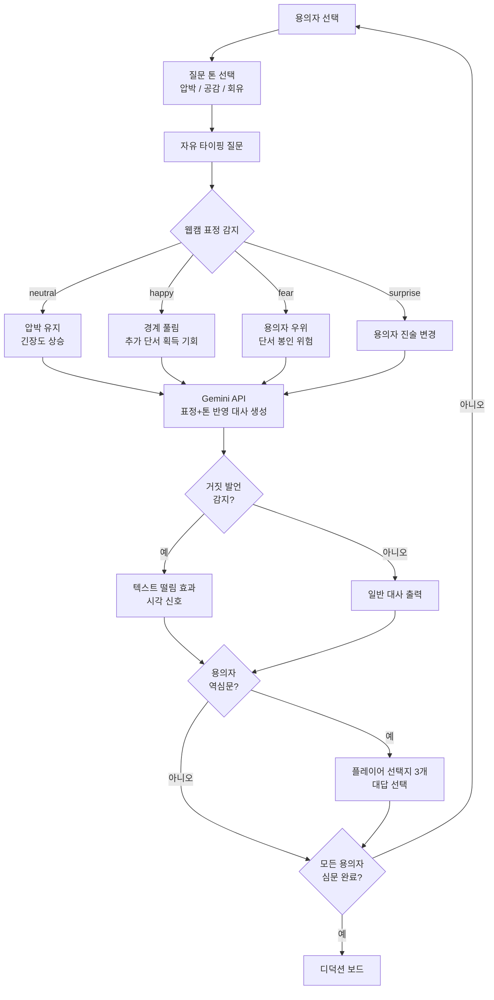
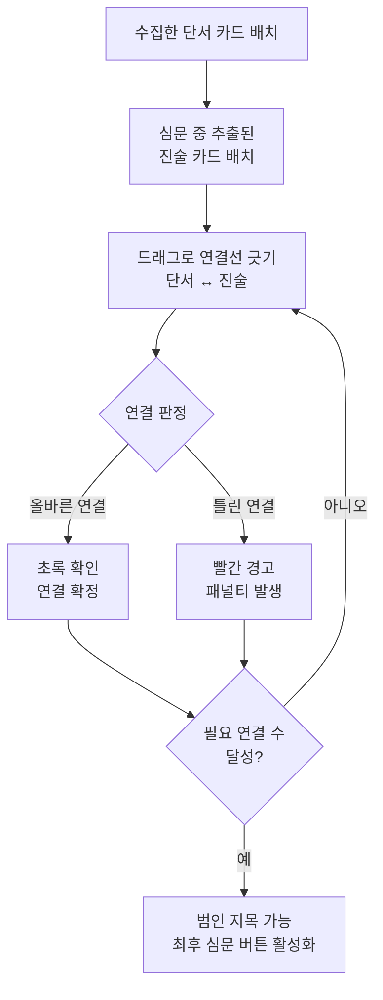
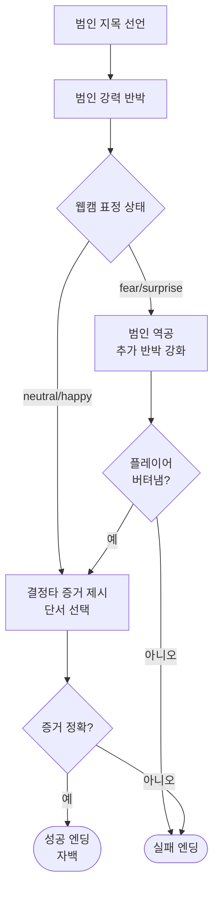
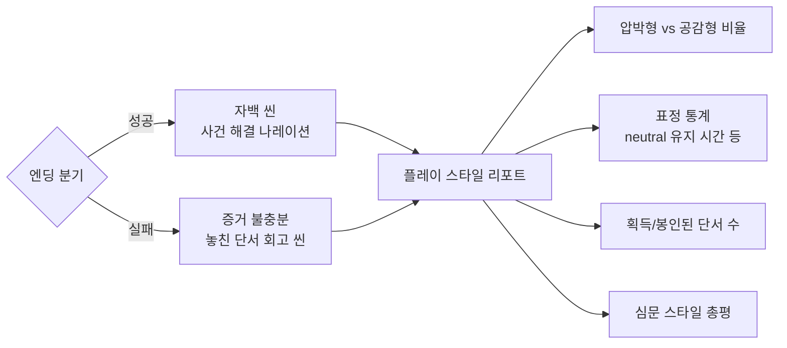

# VERIFACE
> **Verify + Face** — 얼굴로 진실을 검증하다

AI 기반 미스터리 추리 게임. 플레이어가 탐정이 되어 용의자를 심문하고 범인을 밝혀낸다.
웹캠으로 플레이어의 표정을 실시간 감지하여 게임 진행에 반영하는 것이 핵심 차별점이다.

---

## 기술 스택

| 분류 | 기술 |
|------|------|
| 프론트엔드 | React + Vite |
| 백엔드 | FastAPI (Python) |
| AI 스토리/대사 | Gemini 2.5 Flash API |
| 표정 인식 | FER + OpenCV (실시간 웹캠) |
| DB | PostgreSQL + SQLAlchemy |

---

## 전체 게임 플로우

---

## 핵심 메카닉 구조

### 플레이어 입력 → 용의자 반응 흐름

---

## 페이즈별 상세

### 페이즈 1 — 현장 조사

- 클릭으로 단서 카드 수집
- 각 단서에 용의자 연관 힌트 희미하게 표시 → 심문 동기 부여
- 단서 발견 시 강조 애니메이션

---

### 페이즈 2 — 용의자 심문

**표정별 전략 효과**

| 감지 표정 | 전략 의미 | 게임 효과 |
|-----------|-----------|-----------|
| 😐 neutral | 포커페이스 유지 | 압박 지속, 긴장도 서서히 상승 |
| 😄 happy | 의도적 친화 | 경계 풀려 추가 정보 획득 가능 |
| 😮 surprise | 감정 노출 | 용의자가 눈치채고 진술 변경 |
| 😨 fear | 약점 노출 | 용의자 우위, 단서 봉인 위험 |

---

### 페이즈 3 — 디덕션 보드

- 단서 카드와 진술 카드를 직접 연결하는 셜록 홈즈식 추론 보드
- 같은 단서도 두 가지 해석 가능 → 방향 선택이 이후 전개에 영향
- 단서를 언제 꺼낼지 타이밍 전략 적용

---

### 페이즈 4 — 최후 심문

- 표정 감지가 가장 크게 작용하는 구간
- 최후 순간에 얼굴이 흔들리면 범인이 역공
- 수집한 단서 중 "결정타"를 직접 선택해서 제시

---

## 엔딩 & 리포트

---

## VERIFACE 고유 차별점

> 다른 추리 게임은 **게임 속 정보**만 변수다.
> VERIFACE는 **플레이어 본인**이 변수다.

- 웹캠이 탐정인 "나"를 보고 있다
- 내 표정, 질문 톤, 반응 속도가 모두 게임에 영향
- 같은 사건도 플레이어마다 완전히 다른 경험
- 오답도 허용 — 실패가 좌절이 아닌 "다시 하고 싶다"로 연결

---

## 구현 현황

| 페이즈 | 기능 | 상태 |
|--------|------|------|
| 기반 | FastAPI 서버 + React 초기화 | ✅ 완료 |
| 기반 | 웹캠 실시간 표정 감지 | ✅ 완료 |
| 기반 | Gemini 사건/용의자 자동 생성 | ✅ 완료 |
| 페이즈 1 | 현장 조사 UI | ✅ 완료 |
| 페이즈 2 | 용의자 심문 + 표정 연동 | ✅ 완료 |
| 페이즈 2 | 질문 톤 선택 / 거짓말 감지 효과 | 🔧 개발 중 |
| 페이즈 2 | 용의자 역심문 / 단서 봉인 | 🔧 개발 중 |
| 페이즈 3 | 디덕션 보드 | 🔧 개발 중 |
| 페이즈 4 | 최후 심문 | 🔧 개발 중 |
| 엔딩 | 성공/실패 분기 + 리포트 | 🔧 개발 중 |
